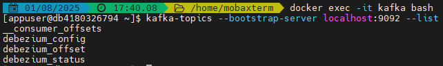

# Pipeline de Dados em Tempo Real com PostgreSQL, Debezium, Kafka e Druid via Docker


## Índice

1. [Objetivo](#1-objetivo)
2. [Componentes](#2-componentes)
3. [Infraestrutura Utilizada](#3-infraestrutura-utilizada)
4. [Arquitetura Docker Compose](#4-arquitetura-docker-compose)

   * Tabela de Produtos, Portas, Versões e Observações
5. [Guia de Uso Local](#5-guia-de-uso-local)

   * Pré-requisitos
   * Instalação
   * Teste do Laboratório

     * Criação da Tabela
     * Criação do Conector Debezium
     * Exclusão do Conector
     * Verificação de Tópicos Kafka
     * Inserção de Dados
     * Verificação do Tópico Kafka
     * Consumindo Tópicos no Druid
6. [Conclusão](#conclusão)

---

## 1. Objetivo

Criar um fluxo streaming iniciando no PostgreSQL, onde a inserção de dados em uma tabela será capturada pelo Debezium, enviada ao Kafka e consumida pelo Druid para visualização e análise.

---

## 2. Componentes

* **PostgreSQL**: Base de dados relacional que serve como origem dos dados a serem capturados.
* **Debezium**: Ferramenta de captura de dados em tempo real (CDC) que detecta alterações no PostgreSQL via replicação lógica e publica no Kafka.
* **Kafka**: Sistema de mensageria distribuída que recebe os eventos do Debezium e os distribui para consumidores.
* **Zookeeper**: Serviço de coordenação usado pelo Kafka para gerenciamento de metadados e orquestração dos brokers.
* **Druid**: Plataforma analítica que consome os tópicos do Kafka e permite a visualização dos dados em tempo real através de dashboards.

---

## 3. Infraestrutura Utilizada

* Servidor Virtual: 16GB RAM, 40GB Disco, 2 vCPU.

---

## 4. Arquitetura Docker Compose


### Tabela de Produtos, Portas, Versões e Observações

| Produto             | Porta(s)                 | Versão | Observação                                                                                                        |
| ------------------- | ------------------------ | ------ | ----------------------------------------------------------------------------------------------------------------- |
| PostgreSQL          | 5432:5432                | 15     | Comando: `wal_level=logical`, necessário para replicação lógica (captura de alterações no WAL - Write Ahead Log). |
| Zookeeper           | 2181:2181                | 3.7.2  | Versão compatível com Kafka 2.8.2.                                                                                |
| Kafka               | 29092:29092, 29093:29093 | 2.8.2  | Confluentinc - Distribuição Confluent.                                                                            |
| Debezium            | 8085:8083                | 2.7    | Serviço de captura CDC.                                                                                           |
| Druid Coordinator   | 8081:8081                | 30.0.0 | Gerencia segmentação de dados.                                                                                    |
| Druid Broker        | 8082:8082                | 30.0.0 | Intermediário de consultas.                                                                                       |
| Druid Historical    | 8083:8083                | 30.0.0 | Armazena dados segmentados.                                                                                       |
| Druid MiddleManager | 8091:8091, 8100-8105     | 30.0.0 | Processa ingestões.                                                                                               |
| Druid Router        | 8888:8888                | 30.0.0 | Interface web e roteamento de APIs.                                                                               |

### Observações

* **Confluentinc**: Distribuição da Confluent que integra Kafka e Zookeeper com ferramentas adicionais. Compatibilidade de versões pode ser conferida [neste link](https://docs.confluent.io/platform/6.1/installation/versions-interoperability.html#interoperability-versions).

---

## 5. Guia de Uso Local

### Pré-requisitos

* Docker
* Docker Compose
* Git

### Instalação

1. Clone o projeto:

```bash
git clone <URL_DO_REPOSITORIO>
cd <diretorio>
```

2. Suba os containers:

```bash
docker compose up -d
```

### Teste do Laboratório

#### Criação da Tabela

Acesse o container PostgreSQL e crie a tabela de exemplo:

```bash
docker exec -it postgres psql -U myuser -d mydb

CREATE TABLE products (
  id SERIAL PRIMARY KEY,
  name TEXT NOT NULL,
  price DECIMAL
);
```

#### Criação do Conector Debezium

Execute o comando abaixo em um terminal Linux para criar o conector:

```bash
curl -X POST http://localhost:8085/connectors \
  -H "Content-Type: application/json" \
  -d '{
    "name": "postgres-products-connector",
    "config": {
      "connector.class": "io.debezium.connector.postgresql.PostgresConnector",
      "plugin.name": "pgoutput",
      "database.hostname": "postgres",
      "database.port": "5432",
      "database.user": "myuser",
      "database.password": "FoolishPassword",
      "database.dbname": "mydb",
      "database.server.name": "druidserver",
      "table.include.list": "public.products",
      "slot.name": "products_slot",
      "publication.autocreate.mode": "filtered",
      "database.include.schema.changes": "false",
      "tombstones.on.delete": "false",
      "key.converter": "org.apache.kafka.connect.json.JsonConverter",
      "value.converter": "org.apache.kafka.connect.json.JsonConverter",
      "topic.prefix": "products"
    }
  }'
```

> Obs: para excluir o conector:
>
> ```bash
> curl -X DELETE http://localhost:8085/connectors/postgres-products-connector  
> ```


#### Verificação de Tópicos Kafka

```bash
docker exec -it kafka bash
kafka-topics --bootstrap-server localhost:9092 --list
```



*Figura 1: Tópicos Kafka padrão*

#### Inserção de Dados no PostgreSQL

```bash
docker exec -it postgres psql -U myuser -d mydb

INSERT INTO products (name, price) VALUES
('Terno', 500.00);
```

#### Verificação do Tópico Kafka

```bash
docker exec -it kafka bash
kafka-topics --bootstrap-server localhost:9092 --list
```


*Figura 2: Novo tópico Kafka criado*


#### Consumindo Tópicos no Druid

1. **Acesse a interface do Druid**

   Abra o navegador e vá até o console do Druid:
   [http://localhost:8888/](http://localhost:8888/)

2. **Inicie o processo de ingestão de dados via Kafka**

   No menu lateral, vá em:
   **Load Data** → **Streaming** → **Kafka**

3. **Configure a conexão com o Kafka**

   Preencha os seguintes campos:

   * `Bootstrap servers`: `kafka:9092`

     > Endereço do broker Kafka que o Druid irá se conectar.
   * `Topic`: `products.public.products`

     > Nome do tópico Kafka que contém os dados a serem consumidos.

   Após preencher, clique em **Apply**.

   
   *Figura 3: Configuração do tópico Kafka no Druid*

4. **Avance para o próximo passo**

   Clique em **Next: Parse Data** para continuar com a definição do formato dos dados recebidos.

5. **Parse dos dados (definição do formato)**

   Nesta etapa, o Druid tentará detectar automaticamente o formato das mensagens do tópico Kafka. Caso os dados estejam em **JSON**, como é comum com eventos do Debezium, você verá uma prévia dos registros.

   * Confirme se os dados estão sendo reconhecidos corretamente.
   * Caso necessário, ajuste manualmente o parser (por exemplo, definindo o formato como `json` ou `avro`, dependendo do seu caso).
   * Clique em **Next: Transform**.

6. **Transformações (opcional)**

   Aqui é possível aplicar transformações nos dados antes da ingestão, como renomear colunas, aplicar filtros ou expressões.

   * Se não for necessário transformar os dados neste momento, apenas clique em **Next: Filter**.

7. **Filtros (opcional)**

   Permite filtrar os dados que serão ingeridos, com base em condições nos campos.

   * Caso deseje ingerir todos os dados, clique diretamente em **Next: Configure schema**.

8. **Configuração do schema**

   Nessa etapa, você define:

   * **Timestamp column**: o campo que será usado como referência temporal no Druid (por padrão, o Debezium envia um campo `ts_ms` com o timestamp da alteração).

   * **Dimensions**: campos que serão usados como atributos categóricos (ex: `name`, `color`).

   * **Metrics**: campos numéricos para agregações (ex: `standardCost`, `listPrice`).

   > Dica: Se estiver usando dados do Debezium, talvez seja necessário configurar o **flattening** para acessar os campos dentro de `payload.after`.

   Após configurar, clique em **Next: Tune**.

9. **Tuning (opcional)**

   Permite ajustes de performance e paralelismo da tarefa de ingestão. Se você não tiver necessidades específicas, pode deixar os valores padrão e clicar em **Next: Publish**.

10. **Publicação da Tarefa de Ingestão**

    * Dê um nome à ingestão, como `kafka-products-ingestion`.
    * Revise todas as configurações.
    * Clique em **Submit** para iniciar o processo.

---

## Conclusão

Este projeto demonstrou, de forma prática, a construção de um fluxo de dados em tempo real utilizando tecnologias modernas de streaming:

* **PostgreSQL** como fonte de dados transacionais;
* **Debezium** para captura de alterações (CDC) via replicação lógica;
* **Kafka** como barramento de eventos distribuído;
* **Druid** como plataforma analítica para ingestão e visualização de dados.

A arquitetura implementada permite que qualquer alteração na base PostgreSQL seja refletida em tempo real nos dashboards do Druid. Essa abordagem é altamente escalável, ideal para sistemas de monitoramento, análise de logs, métricas de negócios, entre outros casos de uso orientados a eventos.

Com o ambiente todo orquestrado via Docker Compose, a replicação do laboratório em outras máquinas é simples, facilitando testes, aprendizado e expansão para projetos maiores.

---

## Referências

 [Kafka Docker-Compose Reference - GitHub](https://github.com/adityajoshi12/kafka-nodejs)

 [Druid Docker-Compose Reference - GitHub](https://github.com/apache/druid/tree/33.0.0#)

 [Druid Documentation](https://druid.apache.org/docs/latest/tutorials/docker)
